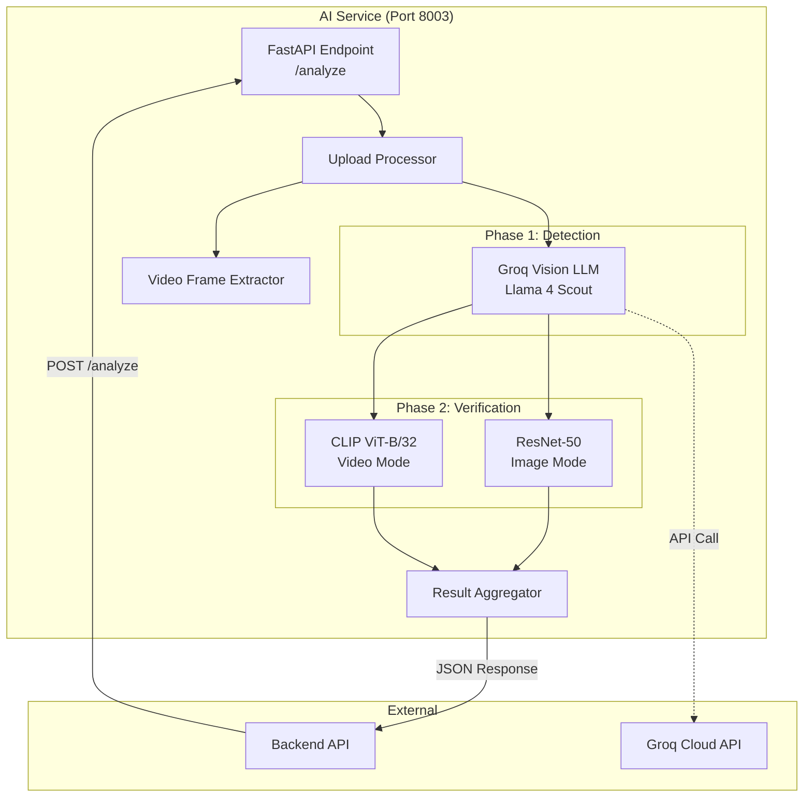
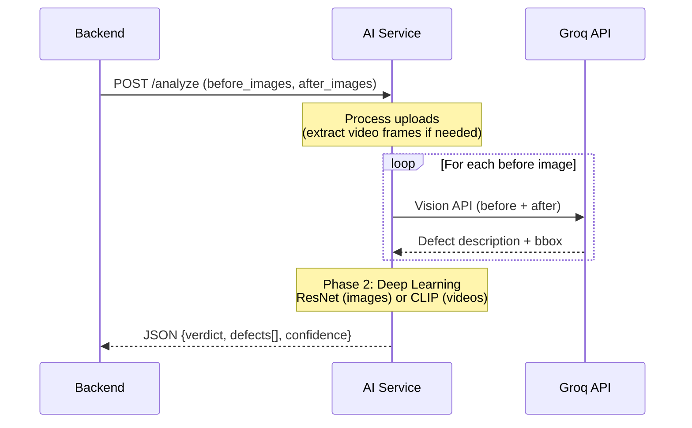
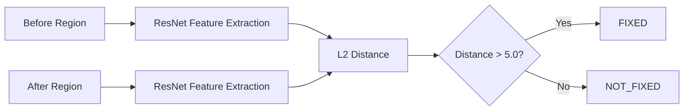
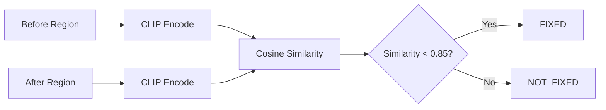
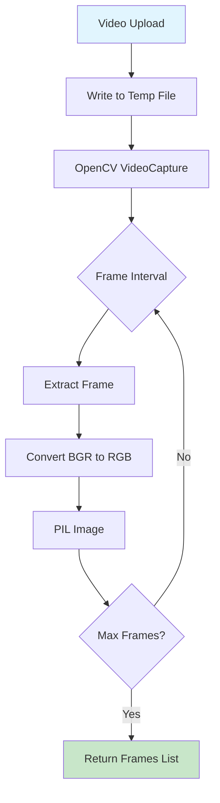
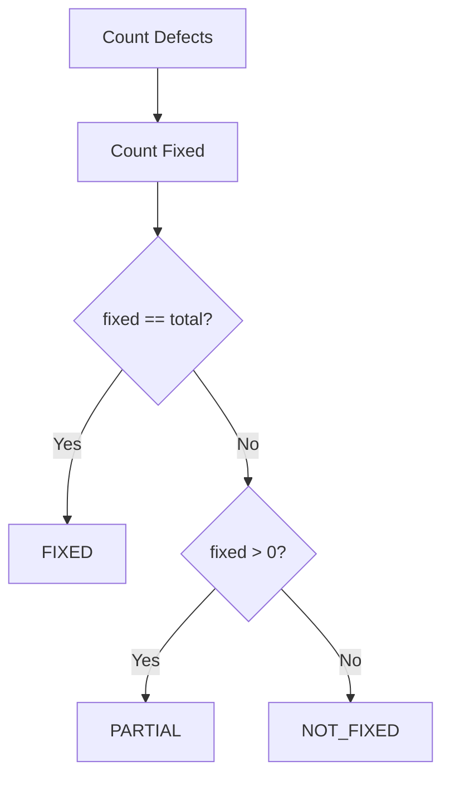

# AI Service

A sophisticated computer vision and deep learning service for automated defect detection and repair verification. This service powers the intelligent work verification system, enabling automated quality assurance through a two-phase AI pipeline.

---

## Table of Contents

1. [Overview](#overview)
2. [Architecture](#architecture)
3. [Technology Stack](#technology-stack)
4. [Two-Phase Detection Pipeline](#two-phase-detection-pipeline)
5. [API Reference](#api-reference)
6. [Core Functions](#core-functions)
7. [Media Processing](#media-processing)
8. [Decision Logic](#decision-logic)
9. [Environment Configuration](#environment-configuration)
10. [Installation](#installation)
11. [Performance Optimizations](#performance-optimizations)
12. [Testing](#testing)

---

## Overview

The AI Service is a FastAPI-based microservice that performs automated defect detection and repair verification. It compares "before" and "after" media (images or videos) to determine whether defects have been successfully repaired.

### Key Capabilities

- Multi-image batch processing
- Video frame extraction and analysis
- Semantic defect localization using Vision LLM
- Deep learning-based repair verification
- Support for both ResNet (images) and CLIP (videos) comparison methods

---

## Architecture



### Service Integration



---

## Technology Stack

| Component | Technology | Purpose |
|-----------|------------|---------|
| **Framework** | FastAPI 0.115.6 | Async REST API framework |
| **Server** | Uvicorn 0.34.2 | ASGI server |
| **Vision LLM** | Groq (Llama 4 Scout) | Defect detection and localization |
| **Deep Learning** | PyTorch 2.5.1 | Neural network inference |
| **Image Model** | ResNet-50 (pretrained) | Feature extraction for image comparison |
| **Video Model** | CLIP ViT-B/32 | Semantic comparison for video frames |
| **Image Processing** | Pillow 11.1.0 | Image manipulation |
| **Video Processing** | OpenCV 4.10.0 | Video frame extraction |
| **Numerical** | NumPy 2.2.2 | Array operations |

---

## Two-Phase Detection Pipeline

The service employs a sophisticated two-phase approach for accurate defect verification:

### Phase 1: Groq Vision Detection

**Purpose:** Identify and localize defects in before images

**Model:** `meta-llama/llama-4-scout-17b-16e-instruct`

**Process:**
1. Convert before and after images to base64
2. Send to Groq Vision API with comparison prompt
3. Extract defect description and bounding box coordinates
4. Return normalized bounding box (percentage-based)

**Prompt Engineering:**
```
Compare TWO images:
- Image 1: BEFORE (showing the defect/damage)
- Image 2: AFTER (potentially repaired)

Identify defects: cracks, breaks, rust, holes, damage, etc.
Return: DEFECT description + LOCATION (x,y,width,height as %)
```

### Phase 2: Deep Learning Verification

**Purpose:** Verify if the detected defect was actually repaired

**Two Methods Based on Media Type:**

#### Image Mode (ResNet-50)


- Uses pretrained ResNet-50 for feature extraction
- Computes L2 (Euclidean) distance between feature vectors
- **Threshold:** Distance > 5.0 indicates significant change (FIXED)

#### Video Mode (CLIP)


- Uses CLIP ViT-B/32 for semantic encoding
- Computes cosine similarity between embeddings
- **Threshold:** Similarity < 0.85 indicates content change (FIXED)
- More robust to video compression artifacts

---

## API Reference

### Health Check

```
GET /
```

**Response:**
```json
{
  "service": "AI Defect Detection",
  "status": "running",
  "phases": [
    "1. Groq Vision detects defect",
    "2. Deep Learning verifies repair"
  ]
}
```

### Analyze Endpoint

```
POST /analyze
Content-Type: multipart/form-data
```

**Parameters:**

| Field | Type | Required | Description |
|-------|------|----------|-------------|
| `before_images` | File[] | Yes | Before images or videos (max 10) |
| `after_images` | File[] | Yes | After images or videos (max 10) |

**Supported Formats:**
- Images: `.jpg`, `.jpeg`, `.png`, `.gif`, `.bmp`, `.webp`
- Videos: `.mp4`, `.mov`, `.avi`, `.mkv`, `.webm`, `.m4v`

**Response:**
```json
{
  "verdict": "FIXED | PARTIAL | NOT_FIXED | NO_DEFECT",
  "summary": "2/3 defects fixed",
  "fixed_count": 2,
  "total_defects": 3,
  "defects": [
    {
      "defect_id": "defect_0",
      "status": "success",
      "description": "Crack in wall surface",
      "before_image_idx": 0,
      "best_after_image_idx": 1,
      "bbox": {
        "x": 25.0,
        "y": 30.0,
        "width": 40.0,
        "height": 35.0
      },
      "phase2_deep_learning": {
        "verdict": "FIXED",
        "is_fixed": true,
        "confidence": 0.87,
        "feature_distance": 8.5,
        "similarity": 0.0,
        "method": "resnet"
      },
      "before_image": "data:image/jpeg;base64,...",
      "after_image": "data:image/jpeg;base64,..."
    }
  ],
  "before_images": ["data:image/jpeg;base64,..."],
  "after_images": ["data:image/jpeg;base64,..."],
  "media_info": {
    "before_frame_count": 1,
    "after_frame_count": 10,
    "before_had_video": false,
    "after_had_video": true
  }
}
```

---

## Core Functions

### Image Processing

| Function | Description |
|----------|-------------|
| `image_to_base64(img)` | Converts PIL Image to base64-encoded JPEG |
| `is_video_file(filename)` | Checks if file is a video based on extension |
| `is_image_file(filename)` | Checks if file is an image based on extension |
| `process_upload(upload)` | Handles both images and videos, returns frames |

### Video Processing

| Function | Description |
|----------|-------------|
| `extract_frames_from_video(content, fps, max_frames)` | Extracts frames from video at specified FPS |
| `filter_matching_frames(reference, frames, threshold)` | Filters video frames similar to reference image |
| `compute_image_similarity(img1, img2)` | Computes ResNet-based similarity (0-1) |

### Detection Functions

| Function | Description |
|----------|-------------|
| `phase1_detect_defect(before, after)` | Groq Vision defect detection |
| `phase2_verify_repair(before_region, after_region)` | ResNet-based verification (images) |
| `phase2_verify_repair_video(before_region, after_region)` | CLIP-based verification (videos) |

### Utility Functions

| Function | Description |
|----------|-------------|
| `convert_bbox_percent_to_pixels(bbox, width, height)` | Converts percentage bbox to pixels |
| `draw_annotations(before, after, bbox, desc, verdict, conf)` | Draws bounding boxes on images |

---

## Media Processing

### Video Frame Extraction



**Default Parameters:**
- FPS: 1.0 (1 frame per second)
- Max Frames: 10

### Frame Matching for Videos

When after media is a video, frames are filtered to only include those visually similar to the before images:

```python
# Threshold: 0.4 (40% similarity required)
matching_frames = filter_matching_frames(before_img, video_frames, threshold=0.4)
```

This handles panning videos where only some frames show the relevant repair area.

---

## Decision Logic

### Overall Verdict Determination



### Confidence Calculation

**ResNet Mode (Images):**
```python
distance = L2_norm(before_features - after_features)
confidence = min(distance / 10.0, 1.0)  # Normalized to 0-1
is_fixed = distance > 5.0
```

**CLIP Mode (Videos):**
```python
similarity = cosine_similarity(before_embedding, after_embedding)
is_fixed = similarity < 0.85

if is_fixed:
    confidence = 1.0 - similarity  # Lower similarity = higher confidence
else:
    confidence = similarity  # Higher similarity = higher confidence
```

### Threshold Summary

| Model | Metric | Threshold | Interpretation |
|-------|--------|-----------|----------------|
| ResNet | L2 Distance | > 5.0 | Significant change = FIXED |
| CLIP | Cosine Similarity | < 0.85 | Content changed = FIXED |
| Frame Matching | Similarity | >= 0.4 | Frame shows same area |

---

## Environment Configuration

```env
# Groq API Key (Vision LLM)
GROQ_API_KEY=gsk_xxxxxxxxxxxxxxxxxxxxxxxxxxxx

# Optional: CUDA device (auto-detected)
CUDA_VISIBLE_DEVICES=0
```

### Hardware Requirements

| Component | Minimum | Recommended |
|-----------|---------|-------------|
| CPU | 4 cores | 8+ cores |
| RAM | 8 GB | 16+ GB |
| GPU | None (CPU fallback) | NVIDIA with 4+ GB VRAM |
| Storage | 500 MB | 2+ GB |

---

## Installation

### Prerequisites

- Python 3.8+
- pip or conda
- (Optional) NVIDIA GPU with CUDA

### Setup

```bash
# Navigate to ai-service directory
cd apps/ai-service

# Create virtual environment
python -m venv venv
source venv/bin/activate  # Linux/Mac
# or
.\venv\Scripts\activate  # Windows

# Install dependencies
pip install -r requirements.txt

# (Optional) Install CLIP for video mode
pip install git+https://github.com/openai/CLIP.git

# Run the service
python main.py
```

### Docker Deployment

```dockerfile
FROM python:3.10-slim

WORKDIR /app

# Install system dependencies for OpenCV
RUN apt-get update && apt-get install -y \
    libgl1-mesa-glx \
    libglib2.0-0 \
    && rm -rf /var/lib/apt/lists/*

COPY requirements.txt .
RUN pip install --no-cache-dir -r requirements.txt

# Optional: Install CLIP
RUN pip install git+https://github.com/openai/CLIP.git

COPY main.py .

CMD ["uvicorn", "main:app", "--host", "0.0.0.0", "--port", "8003"]
```

---

## Performance Optimizations

### Model Loading

- Models are loaded once at startup and cached in memory
- GPU detection is automatic (`cuda` if available, else `cpu`)
- CLIP is optional and gracefully degrades to ResNet if not installed

### Image Processing

```python
# Efficient resizing for neural network input
transform = transforms.Compose([
    transforms.Resize((224, 224)),  # Fixed size for batch processing
    transforms.ToTensor(),
    transforms.Normalize(mean=[0.485, 0.456, 0.406], std=[0.229, 0.224, 0.225])
])
```

### Batch Processing

- Multiple before/after images processed in single request
- Video frames extracted in parallel
- Feature extraction uses `torch.no_grad()` for inference optimization

### Memory Management

- Temporary video files are cleaned up after processing
- Base64 encoding uses 90% JPEG quality for balance
- Frame extraction limits prevent memory overflow (max 10 frames)

### Async Processing

- FastAPI async endpoints for non-blocking I/O
- Uvicorn ASGI server with hot-reload support
- Upload processing is fully async

---

## Testing

### Manual Testing

```bash
# Health check
curl http://localhost:8003/

# Analyze with images
curl -X POST http://localhost:8003/analyze \
  -F "before_images=@before1.jpg" \
  -F "after_images=@after1.jpg"
```

### Python Test Script

```python
# test.py - Batch mode testing
import requests

url = "http://localhost:8003/analyze"

files = [
    ('before_images', ('before1.png', open('before1.png', 'rb'), 'image/png')),
    ('before_images', ('before2.png', open('before2.png', 'rb'), 'image/png')),
    ('after_images', ('after1.png', open('after1.png', 'rb'), 'image/png')),
    ('after_images', ('after2.png', open('after2.png', 'rb'), 'image/png'))
]

response = requests.post(url, files=files, timeout=120)
print(response.json())
```

### Running Tests

```bash
# Start the service
python main.py

# In another terminal, run tests
python test.py
```

---

## Error Handling

| Error | Cause | Resolution |
|-------|-------|------------|
| `Could not extract frames from video` | Corrupted video or unsupported codec | Use standard H.264 MP4 |
| `Could not process file` | Invalid image format | Ensure valid JPEG/PNG |
| `Groq API error` | Rate limit or invalid key | Check API key and limits |
| `CLIP not available` | CLIP not installed | Install CLIP or use images |

---

## Logging

The service provides detailed console logging:

```
[Upload] Received: filename=video.mp4, content_type=video/mp4, size=5242880 bytes
[Upload] Processing as VIDEO: video.mp4
[Video] Duration: 30.0s, FPS: 30.0, Total frames: 900
[Video] Extracted frame 1 at 0.0s
[Video] Extracted 10 frames total
[FrameMatch] Frame 0: similarity = 0.723 (threshold=0.4)
  → MATCHED
[Analyze] Using 6 filtered frames (from 10 total)
[Analyze] Detecting defects in before image 0...
Groq response: DEFECT: Large crack running vertically...
  → Found defect: Large crack running vertically across wall
[CLIP] Cosine similarity: 0.7234
  → FIXED (confidence: 0.28, method: clip)
[Analyze] Final verdict: FIXED (1/1 defects fixed)
```

---

## File Structure

```
ai-service/
├── main.py              # Main FastAPI application
├── requirements.txt     # Python dependencies
├── test.py             # Test script
├── yolov8n.pt          # YOLOv8 weights (optional, for future use)
└── README.md           # This documentation
```

---

## Future Enhancements

1. **YOLOv8 Integration**: Object detection for specific defect types
2. **Model Caching**: Redis-based feature caching for repeated images
3. **Streaming Response**: Real-time progress for large video files
4. **Multi-GPU Support**: Distributed inference for high throughput
5. **Fine-tuned Models**: Domain-specific models for construction/repair

---
