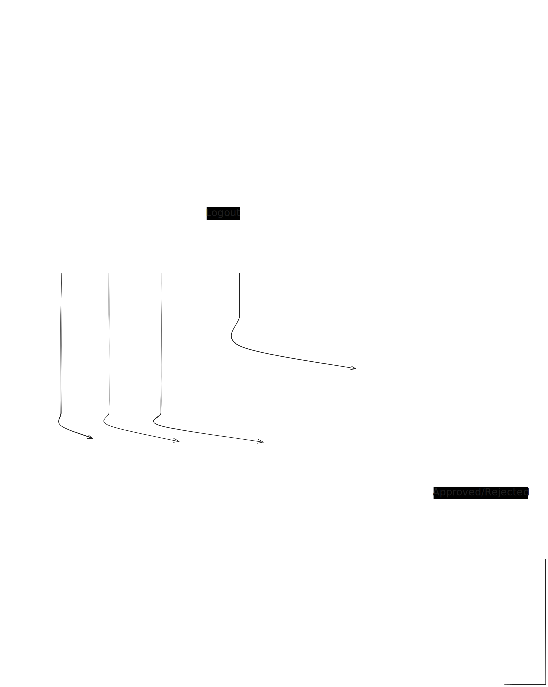
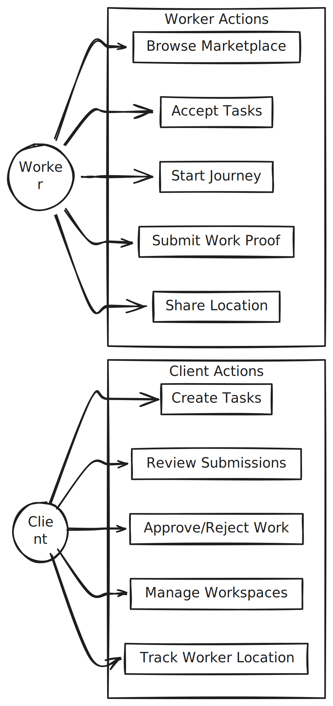

# Web App

A comprehensive task management and workforce coordination platform built with React, TypeScript, and Vite. This application enables clients to create and manage tasks while workers can accept, execute, and submit work for verification through an AI-powered review system.

---

## Table of Contents

1. [Overview](#overview)
2. [Technology Stack](#technology-stack)
3. [Architecture](#architecture)
4. [Application Flow](#application-flow)
5. [Directory Structure](#directory-structure)
6. [Pages](#pages)
7. [Components](#components)
8. [Services](#services)
9. [Hooks](#hooks)
10. [Contexts](#contexts)
11. [Library Utilities](#library-utilities)
12. [Environment Configuration](#environment-configuration)
13. [Local Development](#local-development)
14. [Deployment](#deployment)

---

## Overview

The Web App is a task marketplace platform that connects clients who need work done with workers who can fulfill those tasks. The platform features:

- **Role-based authentication**: Clients post tasks, Workers execute them
- **Task lifecycle management**: From creation through verification to completion
- **Real-time notifications**: Firebase Cloud Messaging for instant updates
- **Location-based tasks**: Google Maps integration for geofenced work
- **AI-powered verification**: Automated defect detection for work validation
- **Workspace collaboration**: Team-based task management with member roles
- **Calendar integration**: Visual task scheduling and deadline tracking

---

## Technology Stack

| Category | Technology | Purpose |
|----------|------------|---------|
| **Framework** | React 19 | UI component library |
| **Language** | TypeScript | Type-safe JavaScript |
| **Build Tool** | Vite 7 | Fast development and bundling |
| **Styling** | Tailwind CSS v4 | Utility-first CSS framework |
| **Routing** | React Router v7 | Client-side navigation |
| **State Management** | React Context | Global state (theme) |
| **HTTP Client** | Axios | API communication |
| **Notifications** | Firebase Cloud Messaging | Push notifications |
| **Real-time Database** | Firebase Realtime Database | Live location tracking |
| **Maps** | Google Maps API | Location features and geofencing |
| **Animations** | Framer Motion, GSAP | UI animations |
| **Icons** | Lucide React | Icon library |
| **Toasts** | React Hot Toast | User feedback notifications |

---

## Architecture

The application follows a modular architecture with clear separation of concerns:

```
┌─────────────────────────────────────────────────────────────────┐
│                        Presentation Layer                        │
│  ┌─────────────┐  ┌─────────────┐  ┌─────────────────────────┐  │
│  │    Pages    │  │  Components │  │        Modals           │  │
│  └──────┬──────┘  └──────┬──────┘  └────────────┬────────────┘  │
│         │                │                      │                │
│         └────────────────┼──────────────────────┘                │
│                          │                                       │
├──────────────────────────┼───────────────────────────────────────┤
│                    State & Logic Layer                           │
│  ┌─────────────┐  ┌──────┴──────┐  ┌─────────────────────────┐  │
│  │   Contexts  │  │    Hooks    │  │      Services           │  │
│  │  (Theme)    │  │ (AI Verify) │  │   (API, Firebase)       │  │
│  └─────────────┘  └─────────────┘  └─────────────────────────┘  │
│                                                                  │
├──────────────────────────────────────────────────────────────────┤
│                      External Services                           │
│  ┌─────────────┐  ┌─────────────┐  ┌─────────────────────────┐  │
│  │ Backend API │  │  Firebase   │  │     Google Maps         │  │
│  │  (REST)     │  │ (FCM + DB)  │  │        API              │  │
│  └─────────────┘  └─────────────┘  └─────────────────────────┘  │
└──────────────────────────────────────────────────────────────────┘
```

---

## Application Flow

The following diagram illustrates the page navigation and user flow:



### Task State Flow


### User Role Permissions



---

## Directory Structure

```
src/
├── App.tsx                 # Root component with routing configuration
├── App.css                 # Global application styles
├── main.tsx                # Application entry point
├── index.css               # Base CSS and Tailwind imports
│
├── pages/                  # Page-level components (routes)
│   ├── Login.tsx           # User authentication
│   ├── Register.tsx        # New user registration
│   ├── Dashboard.tsx       # Main dashboard with task overview
│   ├── MyTasks.tsx         # User-specific task list
│   ├── Calendar.tsx        # Calendar view of tasks
│   ├── Workspaces.tsx      # Workspace management
│   ├── TaskDetails.tsx     # Individual task view
│   ├── TaskReview.tsx      # Client review interface
│   ├── WorkVerification.tsx # Worker submission interface
│   ├── Marketplace.tsx     # Public task marketplace
│   ├── CreateTask.tsx      # Task creation form
│   ├── CreateProject.tsx   # Project creation form
│   └── ProjectDetails.tsx  # Project details view
│
├── components/             # Reusable UI components
│   ├── DashboardLayout.tsx # Main layout wrapper
│   ├── Layout.tsx          # Generic layout component
│   ├── AiVerification.tsx  # AI verification display
│   ├── AiVerification.css  # AI verification styles
│   │
│   ├── auth/               # Authentication components
│   │   └── AuthLayout.tsx  # Auth pages wrapper
│   │
│   ├── modals/             # Modal dialogs
│   │   ├── CreateProjectModal.tsx
│   │   ├── TaskDetailsModal.tsx
│   │   └── PendingInvitationsModal.tsx
│   │
│   ├── tracking/           # Location tracking
│   │   └── LiveLocationMap.tsx
│   │
│   └── ui/                 # Base UI components
│       ├── Button.tsx
│       ├── Card.tsx
│       ├── Input.tsx
│       ├── Modal.tsx
│       ├── Dropdown.tsx
│       ├── DatePicker.tsx
│       ├── Skeleton.tsx
│       ├── TaskCardSkeleton.tsx
│       ├── CalendarSkeleton.tsx
│       ├── CustomScrollbar.tsx
│       └── ImageWithBoundingBox.tsx
│
├── services/               # API and external service integrations
│   └── api.ts              # REST API client and type definitions
│
├── hooks/                  # Custom React hooks
│   └── useAiVerification.ts # AI verification hook
│
├── contexts/               # React context providers
│   └── ThemeContext.tsx    # Dark/light theme management
│
├── lib/                    # Utility libraries
│   ├── firebase.ts         # Firebase configuration and helpers
│   └── utils.ts            # General utility functions
│
└── assets/                 # Static assets
    └── react.svg           # React logo
```

---

## Pages

### Authentication Pages

#### Login (`/login`)
Handles user authentication with email and password. Features include:
- Email and password validation
- "Remember me" functionality persisting email to localStorage
- JWT token decoding for extracting user data (ID, role, name)
- Automatic redirect to dashboard on successful login
- Password visibility toggle

#### Register (`/register`)
New user registration with role selection:
- Name, email, and password input
- Role selection dropdown (Worker or Client)
- Automatic login after successful registration
- JWT token handling identical to login flow

### Main Application Pages

#### Dashboard (`/dashboard`)
The primary interface after authentication:
- Task overview with filtering capabilities
- Quick actions for task creation
- Task cards with status indicators
- Search functionality
- Role-based task display (client sees created tasks, worker sees accepted tasks)
- Integration with CreateProjectModal for task creation

#### My Tasks (`/my-tasks`)
Personalized task management:
- Tabbed interface for filtering by status
- Task cards with detailed status information
- Time tracking and deadline display
- Navigation to task details and verification

#### Calendar (`/calendar`)
Visual task scheduling:
- Monthly calendar grid view
- Task indicators on dates with deadlines
- Collapsible task details panel
- Navigation between months
- Today highlight and selection
- Task status color coding

#### Workspaces (`/workspaces`)
Team collaboration management:
- Create and manage workspaces
- Invite members with auto-generated credentials
- Role management (Owner, Admin, Member)
- Workspace switching
- Export workspace data to Google Sheets
- Pending invitation management

### Task Workflow Pages

#### Task Details (`/tasks/:id`)
Comprehensive task information:
- Task metadata (title, description, budget, deadline)
- Before images gallery with navigation
- Location information with map display
- Client and worker information
- Status-based action buttons
- Live location tracking for en-route workers
- Task acceptance for workers
- Journey start and arrival marking

#### Work Verification (`/tasks/:id/verify`)
Worker submission interface:
- File upload for proof images (supports images and videos)
- AI-assisted verification preview
- Image gallery management
- Submission with multi-file FormData
- Status tracking for uploaded media

#### Task Review (`/tasks/:id/review`)
Client review interface:
- Before and after image comparison
- AI verification results display
- Approve or reject actions
- Rejection reason input
- Download proof functionality

---

## Components

### Layout Components

#### DashboardLayout
The main application shell providing:
- Sidebar navigation with active state highlighting
- Workspace selector dropdown
- Theme toggle (dark/light mode)
- User profile section with logout
- Pending invitation notifications
- Responsive design adaptations

#### AuthLayout
Wrapper for authentication pages:
- Centered form layout
- Branded header with title and subtitle
- Consistent styling across login and register

### Modal Components

#### CreateProjectModal
Multi-step task creation wizard:
1. **Step 1**: Basic information (title, description, category, budget)
2. **Step 2**: Location configuration with Google Maps
3. **Step 3**: Image upload and deadline setting

Features:
- AI-powered description enhancement
- Google Maps location picker with reverse geocoding
- Multi-image upload with preview
- Form validation between steps
- Edit mode for existing tasks

#### TaskDetailsModal
Quick task view overlay:
- Full task details without page navigation
- Action buttons based on task status
- Image gallery display
- Close on overlay click or button

#### PendingInvitationsModal
Workspace invitation management:
- List of pending workspace invitations
- Accept or reject actions per invitation
- Workspace owner information display

### UI Components

| Component | Description |
|-----------|-------------|
| **Button** | Primary action button with loading states and variants |
| **Card** | Container component with theme-aware styling |
| **Input** | Form input with label and validation support |
| **Modal** | Generic modal wrapper with backdrop |
| **Dropdown** | Select component with custom styling |
| **DatePicker** | Calendar-based date selection |
| **Skeleton** | Loading placeholder animations |
| **TaskCardSkeleton** | Task card loading state |
| **CalendarSkeleton** | Calendar loading state |
| **CustomScrollbar** | Styled scrollbar wrapper |
| **ImageWithBoundingBox** | Image display with AI-generated bounding boxes |

### Specialized Components

#### AiVerification
Displays AI verification results:
- Verification status (verified/not verified)
- Confidence score with progress bar
- Defect description and verdict
- Annotated before/after images
- Analysis summary

#### LiveLocationMap
Real-time worker location tracking:
- Google Maps integration
- Worker location marker with updates
- Destination marker with geofence circle
- Route directions rendering
- ETA and distance calculations
- Arrival detection with callback

---

## Services

### API Service (`services/api.ts`)

The API service provides a centralized Axios client with automatic token handling and endpoint definitions.

#### Configuration
```typescript
const API_URL = import.meta.env.VITE_API_URL || 'http://localhost:3001';
```

#### Request Interceptor
- Automatically attaches JWT token from localStorage
- Sets Content-Type to application/json for non-FormData requests
- Allows browser to set multipart boundary for FormData

#### API Modules

##### authAPI
| Method | Endpoint | Description |
|--------|----------|-------------|
| `register` | POST `/v0/auth/register` | Create new user account |
| `login` | POST `/v0/auth/login` | Authenticate user |
| `getProfile` | GET `/v0/auth/profile` | Get current user profile |
| `updateFcmToken` | POST `/v0/auth/fcm-token` | Update FCM token for notifications |
| `checkUserExists` | GET `/v0/auth/check-user-exists` | Check if email is registered |

##### tasksAPI
| Method | Endpoint | Description |
|--------|----------|-------------|
| `getMarketplace` | GET `/v0/tasks` | Get available tasks with filters |
| `getTask` | GET `/v0/tasks/:id` | Get single task details |
| `createTask` | POST `/v0/tasks` | Create new task |
| `updateTask` | PUT `/v0/tasks/:id` | Update existing task |
| `deleteTask` | DELETE `/v0/tasks/:id` | Remove task |
| `acceptTask` | POST `/v0/tasks/:id/accept` | Worker accepts task |
| `startJourney` | POST `/v0/tasks/:id/en-route` | Worker starts travel |
| `markArrived` | POST `/v0/tasks/:id/arrived` | Worker arrives at location |
| `startWork` | POST `/v0/tasks/:id/start` | Worker begins task |
| `submitWork` | POST `/v0/tasks/:id/submit` | Submit work with proof |
| `approveWork` | POST `/v0/tasks/:id/approve` | Client approves submission |
| `rejectWork` | POST `/v0/tasks/:id/reject` | Client rejects with reason |
| `disputeTask` | POST `/v0/tasks/:id/dispute` | Raise a dispute |
| `enhanceDescription` | POST `/v0/tasks/enhance-description` | AI description enhancement |

##### workspacesAPI
| Method | Endpoint | Description |
|--------|----------|-------------|
| `getMyWorkspaces` | GET `/v0/workspaces` | List user's workspaces |
| `getActiveWorkspace` | GET `/v0/workspaces/active` | Get current workspace |
| `setActiveWorkspace` | POST `/v0/workspaces/active/:id` | Switch workspace |
| `getWorkspace` | GET `/v0/workspaces/:id` | Get workspace details |
| `createWorkspace` | POST `/v0/workspaces` | Create new workspace |
| `updateWorkspace` | PUT `/v0/workspaces/:id` | Update workspace |
| `deleteWorkspace` | DELETE `/v0/workspaces/:id` | Remove workspace |
| `inviteMember` | POST `/v0/workspaces/:id/members` | Invite user to workspace |
| `removeMember` | DELETE `/v0/workspaces/:id/members/:userId` | Remove member |
| `updateMemberRole` | PUT `/v0/workspaces/:id/members/:userId` | Change member role |
| `getPendingInvitations` | GET `/v0/workspaces/invitations/pending` | List pending invites |
| `acceptInvitation` | POST `/v0/workspaces/invitations/:id/accept` | Accept invite |
| `rejectInvitation` | POST `/v0/workspaces/invitations/:id/reject` | Reject invite |
| `exportWorkspaceToSheets` | POST `/v0/export/workspace-to-sheets` | Export to Google Sheets |

#### Type Definitions
The service exports TypeScript interfaces for:
- `User` - User profile data
- `Task` - Task information including images, location, status
- `Workspace` - Workspace with owner and members
- `WorkspaceMember` - Member with role and invite status
- `PendingInvitation` - Invitation with workspace details

---

## Hooks

### useAiVerification

Custom hook for AI-powered work verification:

```typescript
interface AiVerificationResult {
    verified: boolean;
    confidence: number;
    defectDescription: string;
    defectLocation: number[] | null;
    featureDistance: number;
    verdict: string;
    summary: string;
    annotatedBeforeImage: string | null;
    annotatedAfterImage: string | null;
}

function useAiVerification(): {
    verifyProof: (proofId: string) => Promise<AiVerificationResult>;
    loading: boolean;
    result: AiVerificationResult | null;
    error: string | null;
    reset: () => void;
}
```

#### Usage
```typescript
const { verifyProof, loading, result, error, reset } = useAiVerification();

// Trigger verification
await verifyProof(proofId);

// Access results
if (result?.verified) {
    console.log('Work verified with confidence:', result.confidence);
}
```

---

## Contexts

### ThemeContext

Global theme state management for dark/light mode:

```typescript
type Theme = 'light' | 'dark';

interface ThemeContextType {
    theme: Theme;
    toggleTheme: () => void;
}
```

#### Features
- Persists theme preference to localStorage
- Default theme is dark mode
- Provides toggle function for switching

#### Usage
```typescript
import { useTheme } from '../contexts/ThemeContext';

function Component() {
    const { theme, toggleTheme } = useTheme();
    
    return (
        <div className={theme === 'dark' ? 'bg-slate-900' : 'bg-white'}>
            <button onClick={toggleTheme}>Toggle Theme</button>
        </div>
    );
}
```

---

## Library Utilities

### Firebase (`lib/firebase.ts`)

Comprehensive Firebase integration for notifications and real-time features.

#### Initialization
- Validates environment variables before initialization
- Configures Firebase App, Messaging, and Realtime Database
- Handles missing configuration gracefully

#### Push Notifications

```typescript
// Request FCM token for push notifications
const token = await requestForToken();

// Listen for foreground messages
onMessageListener().then((payload) => {
    // Handle incoming notification
});
```

#### Location Tracking

```typescript
// Worker: Update location
await updateWorkerLocation(taskId, {
    lat: 12.9716,
    lng: 77.5946,
    heading: 180,
    speed: 5.5,
    workerId: 'user123',
    workerName: 'John Doe'
});

// Client: Subscribe to updates
const unsubscribe = subscribeToWorkerLocation(taskId, (location) => {
    if (location) {
        console.log('Worker at:', location.lat, location.lng);
    }
});

// Cleanup
unsubscribe();

// Clear location when done
await clearWorkerLocation(taskId);
```

#### WorkerLocation Interface
```typescript
interface WorkerLocation {
    lat: number;
    lng: number;
    heading?: number;
    speed?: number;
    updatedAt: number;
    workerId: string;
    workerName: string;
}
```

### Utils (`lib/utils.ts`)

Utility functions for common operations:

```typescript
import { cn } from '../lib/utils';

// Merge class names with Tailwind conflict resolution
const className = cn(
    'base-class',
    condition && 'conditional-class',
    'override-class'
);
```

---

## Environment Configuration

### Required Environment Variables

Create a `.env` file based on `.env.example`:

```bash
# API Configuration
VITE_API_URL=https://your-api-url.com

# Firebase Configuration
VITE_FIREBASE_API_KEY=your_firebase_api_key
VITE_FIREBASE_AUTH_DOMAIN=your_project.firebaseapp.com
VITE_FIREBASE_PROJECT_ID=your_project_id
VITE_FIREBASE_STORAGE_BUCKET=your_project.appspot.com
VITE_FIREBASE_MESSAGING_SENDER_ID=your_sender_id
VITE_FIREBASE_APP_ID=your_app_id
VITE_FIREBASE_VAPID_KEY=your_vapid_key
VITE_FIREBASE_DATABASE_URL=https://your_project.firebaseio.com

# Google Maps API Key
VITE_GOOGLE_MAPS_API_KEY=your_google_maps_api_key
```

### Environment Variable Notes

1. **VITE_ Prefix**: All client-side environment variables must be prefixed with `VITE_` to be exposed to the browser.

2. **Build-time Embedding**: Vite embeds environment variables at build time. Changes require a rebuild.

3. **Firebase Configuration**: Obtain these values from the Firebase Console under Project Settings.

4. **Google Maps**: Enable Maps JavaScript API and Geocoding API in Google Cloud Console.

---

## Local Development

### Prerequisites
- Node.js 18 or higher
- npm or yarn package manager

### Setup

```bash
# Navigate to web directory
cd apps/web

# Install dependencies
npm install

# Copy environment template
cp .env.example .env

# Configure environment variables
# Edit .env with your values

# Start development server
npm run dev
```

The application will be available at `http://localhost:5173`

### Available Scripts

| Script | Description |
|--------|-------------|
| `npm run dev` | Start development server with HMR |
| `npm run build` | Build production bundle |
| `npm run preview` | Preview production build locally |
| `npm run lint` | Run ESLint for code quality |

---

## Deployment

### Vercel Deployment

The application includes a `vercel.json` configuration for seamless deployment.

#### Configuration
```json
{
  "buildCommand": "npm run build",
  "outputDirectory": "dist",
  "framework": "vite",
  "rewrites": [
    {
      "source": "/((?!api/).*)",
      "destination": "/index.html"
    }
  ]
}
```

#### Deployment Steps

1. **Via Vercel Dashboard**:
   - Connect your Git repository
   - Set root directory to `apps/web`
   - Configure environment variables
   - Deploy

2. **Via Vercel CLI**:
   ```bash
   npm i -g vercel
   vercel login
   vercel --prod
   ```

#### Post-Deployment Configuration

1. **Firebase**: Add your Vercel domain to Firebase authorized domains
2. **Google Maps**: Add your Vercel domain to API key restrictions
3. **API URL**: Ensure `VITE_API_URL` points to your production backend

---

## Additional Notes

### Browser Support
- Chrome (recommended)
- Firefox
- Safari
- Edge
